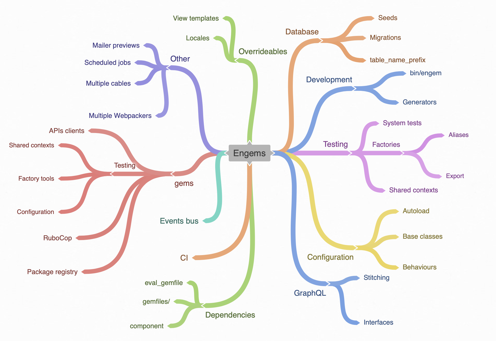

# Engems

This repository contains examples/scripts for building Rails component-based architecture on top of engines and gems.

  

## Guides

- [Organizing dependencies/gemfiles](./guides/gemfiles.md)
- [Testing](./guides/testing.md)

## Examples

- [Generators](./examples/generators)
- [Local gems](./examples/gems)

## Scripts

- [bin/engem](./scripts/engem-cli)—CLI to manage components from the project's root

## Resources

- "Between monoliths and microservices" at RailsConf ([slides and video](https://noti.st/palkan/VWPOSd/between-monoliths-and-microservices))
- "Engine-ering Rails apps" at Saint-P Ruby ([slides](https://speakerdeck.com/palkan/saint-p-ruby-meetup-engine-ering-rails-apps))
